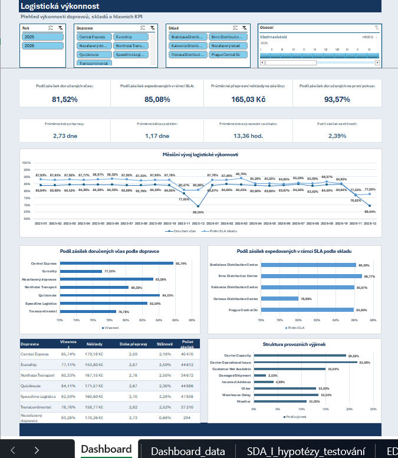
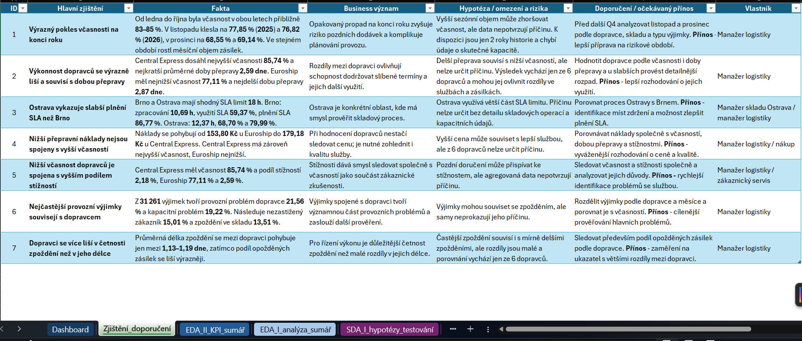

# 📊 Data Analytics End-to-End Projects Portfolio

Portfolio praktických analytických projektů zaměřených na **řešení business problémů od zdrojových dat až po finální interpretaci a reporting**.

Repozitář postupně pokrývá práci s Excelem, Power Query, SQL Serverem, Power BI, DAX, Pythonem, API a automatizací. Jednotlivé projekty používají různé business scénáře a technologie tak, aby se jejich zaměření zbytečně neopakovalo.

Hlavní důraz je kladen na:
- pochopení business problému;
- kontrolu kvality a přípravu dat;
- přiměřený návrh transformačního procesu;
- analytickou interpretaci;
- KPI a datové modelování;
- reporting a dashboardy;
- dokumentaci rozhodnutí, omezení a doporučení.

---

# 📂 Struktura repozitáře

```text
da-end-to-end-projects-portfolio/

├── projects/
│   ├── project-01-csv-excel-power-query/
│   │   ├── data/
│   │   ├── output/
│   │   ├── dataset_manifest.csv
│   │   └── README.md
│   │
│   ├── project-02-sql-power-bi-dax/
│   │   └── README.md
│   │
│   └── project-03-api-python-sql-power-bi/
│       └── README.md
│
├── workflow/
│   └── analytical-workflow.md
│
└── README.md
```

---

# 🎯 Projekty

## ✅ Project 01 — Logistics Performance & Service Level Analysis

**CSV + Power Query + Excel**

Dokončený end-to-end projekt zaměřený na výkonnost logistického procesu smyšlené distribuční společnosti.

Projekt analyzuje **250 000 unikátních zásilek za období 2025–2026**, referenční data a zákaznické stížnosti. Cílem je identifikovat hlavní zdroje nedodržování dodacích termínů, porovnat výkonnost dopravců a skladů a určit oblasti vhodné pro další provozní opatření.

Hlavní oblasti:
- spojení 24 měsíčních CSV exportů;
- čištění, validace a kontrola referenční integrity v Power Query;
- příprava analytické tabulky v Excel Data Modelu;
- průzkumná a statistická analýza;
- KPI pro včasnost, SLA, náklady a kvalitu doručení;
- jednostránkový interaktivní Excel dashboard;
- interpretace zjištění a návrh doporučení.

Hlavní technologie:
```text
Excel
Power Query
Excel Data Model
Git
GitHub
```





➡️ [Otevřít Project 01](projects/project-01-csv-excel-power-query/)

---

## 🟡 Project 02 — Customer Retention & Subscription Analytics

**SQL Server + Power BI**

Projekt, který byl již započat a jeho řešení probíhá a který je zaměřený na zákaznickou retenci a odchody ve firmě se subscription modelem.

Business cílem je zjistit, ve kterých segmentech se churn koncentruje, jak souvisí s tarifem, délkou vztahu nebo kontakty na zákaznickou podporu a které skupiny zákazníků jsou finančně nejvýznamnější.

Rozsah:
- přibližně **50 000 zákazníků**;
- přibližně **1,5 milionu řádků** napříč relačními tabulkami;
- hlavní transformační a analytická vrstva v SQL;
- hvězdicový model, DAX a management dashboard v Power BI.

Hlavní technologie:
```text
SQL Server / LocalDB
SQL
Power BI
Power Query
DAX
Git
GitHub
```

Cílem projektu je ukázat práci s relačními daty, SQL čištěním a validací, business logikou, analytickými dotazy a následným reportingem v Power BI.

➡️ [Otevřít Project 02](projects/project-02-sql-power-bi-dax/)

---

## 🟡 Project 03 — Investment Fund Performance & Risk Analytics

**API + Python + SQL Server + Power BI**

Plánovaný projekt zaměřený na historickou výkonnost a rizikovost vybraných investičních fondů.

Projekt bude pracovat s reálnými veřejně dostupnými daty získanými přes API a zaměří se například na:
- kumulativní a anualizovaný výnos;
- klouzavý 12měsíční výnos;
- volatilitu;
- maximální propad;
- dobu zotavení;
- nejlepší a nejhorší období;
- případně korelaci výnosů mezi fondy.

Hlavní technologický tok:
```text
API
→ Python
→ validace a výpočty
→ SQL Server / LocalDB
→ Power BI
```

Python bude použit také pro inkrementální načítání, logování a opakované spouštění procesu pomocí `.bat` souboru a Windows Task Scheduleru.

Plánované hlavní technologie:
```text
Python
API
Pandas
SQL Server / LocalDB
SQL
Power BI
Power Query
DAX
BAT
Windows Task Scheduler
Git
GitHub
```

Cílem projektu je rozšířit portfolio o práci s API, Pythonem, časovými řadami a jednoduchým automatizovaným datovým procesem.

➡️ [Otevřít Project 03](projects/project-03-api-python-sql-power-bi/)

---

# 🧭 Analytický workflow

Součástí repozitáře je také obecný analytický workflow používaný jako rámec pro plánování a realizaci jednotlivých projektů.

Pokrývá zejména:
```text
Business problém
→ datové zdroje
→ architektonické rozhodnutí
→ získání dat
→ kvalita a validace
→ transformace
→ analýza
→ datový model
→ KPI
→ dashboard
→ interpretace a doporučení
→ automatizace
→ dokumentace
```

Workflow slouží jako praktická kontrolní struktura, ne jako požadavek použít ve všech projektech stejné technologie nebo všechny možné kroky.

➡️ [Otevřít analytický workflow](workflow/analytical-workflow.md)

---

# 🧩 Zaměření portfolia

Jednotlivé projekty jsou záměrně postavené tak, aby ukazovaly odlišné analytické workflow:
```text
Project 01
→ Excel + Power Query
→ logistická výkonnost
→ hlavní transformace v Power Query

Project 02
→ SQL Server + Power BI
→ zákaznická retence
→ hlavní transformace a analytická příprava v SQL

Project 03
→ API + Python + SQL Server + Power BI
→ investiční fondy
→ získávání dat, automatizace a analýza časových řad
```

Cílem není použít všechny technologie v každém projektu, ale dát každému nástroji jasnou roli podle konkrétního business a datového problému.

---

# 🛠 Technologie a oblasti

```text
Excel
Power Query
Excel Data Model
SQL
SQL Server LocalDB
Power BI
DAX
Python
Pandas
REST API
BAT
Windows Task Scheduler
data validation
data modeling
EDA
statistical analysis
KPI
dashboarding
automation
Git
GitHub
VS Code
```