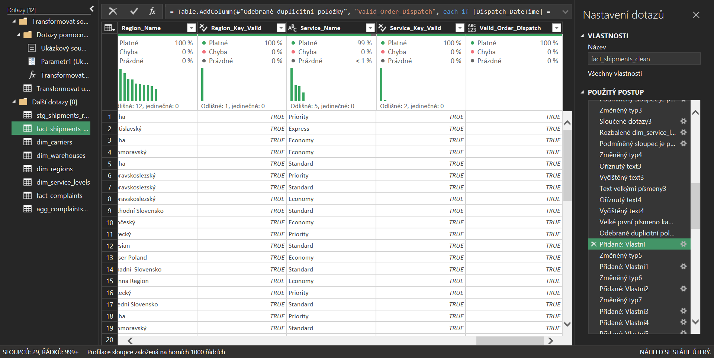
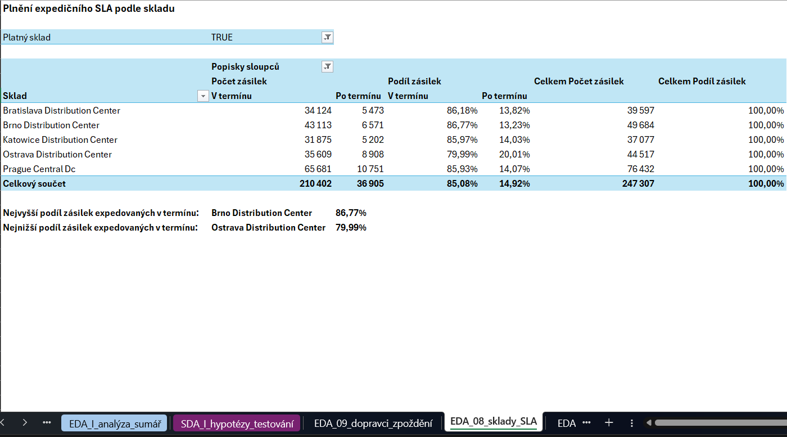
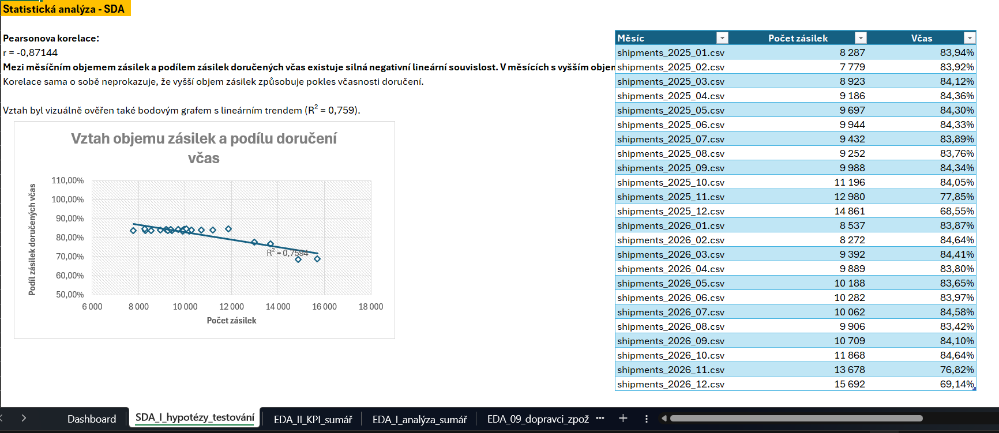

# Project 01 – Logistics Performance & Service Level Analysis
## CSV, Power Query & Excel

# Přehled projektu

Projekt analyzuje výkonnost logistického procesu smyšlené distribuční společnosti, která řeší pozdní doručení a rozdíly v přepravních nákladech. Cílem je identifikovat hlavní zdroje nedodržování dodacích termínů, porovnat výkonnost dopravců a skladů a určit oblasti, na které má smysl zaměřit další provozní opatření.

Analýza vychází z **24 měsíčních CSV exportů za období 2025–2026** a zahrnuje **250 000 unikátních zásilek**, referenční data a zákaznické stížnosti.

- **Nástroje:** Excel, Power Query a Excel Data Model.
- **Zpracování dat:** spojení měsíčních exportů, kontrola kvality, čištění, validace, transformace a příprava analytické tabulky.
- **Analýza:** průzkumná analýza dat, statistické ověření vybraných vztahů, KPI a porovnání výkonnosti dopravců a skladů.
- **Hlavní výstup:** datově podložená zjištění a doporučení pro řízení logistického procesu, doplněná interaktivním Excel dashboardem.
- **Business přínos:** podpora rozhodování o výkonnosti dopravců a skladů, plnění SLA, přepravních nákladech a prioritách pro další provozní prověření.


---

# Business problém

Společnost provozuje několik distribučních skladů a využívá více externích dopravců. Management eviduje pozdní doručení, zákaznické stížnosti a rozdíly v přepravních nákladech, ale nemá jednotný pohled na to, kde se problémy koncentrují.

Projekt má podpořit zejména rozhodování o:

- výkonnosti a využívání dopravců;
- procesech v jednotlivých skladech;
- plnění expedičního SLA;
- vztahu mezi cenou a kvalitou přepravní služby;
- prioritách pro další provozní analýzu.

Hlavní analytické otázky:

1. Jak se vyvíjí včasnost doručení v čase?
2. Jak se liší výkon dopravců?
3. Jak dlouho trvá skladové zpracování a jak sklady plní SLA?
4. Jak se liší přepravní náklady a jak souvisejí s včasností?
5. Jak se s výkonem dopravců pojí stížnosti a provozní výjimky?
6. Je důležitější četnost zpoždění, nebo jeho průměrná délka?

---

# Cíloví uživatelé

Primárním uživatelem je **manažer logistiky**.

Sekundárními uživateli jsou:

- provozní management;
- skladoví manažeři;
- nákup;
- zákaznický servis;
- další stakeholdery sledující logistickou výkonnost.

---

# Zdroje dat

Projekt pracuje se syntetickými CSV daty simulujícími pravidelné exporty z logistického systému.

| Zdroj | Obsah | Granularita |
|---|---|---|
| `shipments_YYYY_MM.csv` | 24 měsíčních exportů zásilek | 1 řádek = 1 zásilka |
| `carriers.csv` | dopravci | 1 řádek = 1 dopravce |
| `warehouses.csv` | sklady a jejich SLA | 1 řádek = 1 sklad |
| `regions.csv` | regiony | 1 řádek = 1 region |
| `service_levels.csv` | přepravní služby | 1 řádek = 1 služba |
| `complaints.csv` | zákaznické stížnosti | 1 řádek = 1 stížnost |

Data pokrývají období **1. 1. 2025 – 31. 12. 2026** a vybrané regiony střední Evropy.

Dataset je syntetický a neobsahuje skutečná osobní ani důvěrná data.

---

# Architektura

Hlavní tok zpracování:

```text
data/raw/
    ↓
Power Query – From Folder / Combine
    ↓
stg_shipments_raw
    ↓
čištění + validace + spojení referencí
    ↓
agregace stížností + analytické výpočty
    ↓
fact_shipments_clean
    ↓
Excel Data Model
    ↓
EDA + statistická analýza + KPI
    ↓
dashboard + zjištění a doporučení
```

Do Excel Data Modelu je načtena pouze široká analytická tabulka `fact_shipments_clean`.

Referenční a pomocné dotazy zůstávají jako **pouze připojení**. Projekt proto nepoužívá samostatné hvězdicové schéma v Excel Data Modelu.

---

# Role nástrojů

| Nástroj | Role v projektu |
|---|---|
| CSV | zdrojová data a referenční tabulky |
| Power Query | načtení, spojení, čištění, validace a transformační logika |
| Excel Data Model | uložení finální analytické tabulky |
| Excel | kontingenční tabulky, EDA, statistická analýza, KPI a dashboard |
| Git / GitHub | verzování a publikace portfolio projektu |

Projekt nepoužívá Python ani SQL, proto neobsahuje Python závislosti, `.env` konfiguraci ani SQL/Python skripty.

---

# Kvalita dat

Zdrojová data záměrně obsahovala běžné provozní problémy:

- přesné duplicity;
- chybějící hodnoty;
- nekonzistentní desetinné oddělovače;
- různé zápisy logických hodnot;
- neplatné referenční klíče;
- časové nekonzistence.

## Hlavní kontroly

- sjednocení datových typů a textových hodnot;
- odstranění **287 přesných duplicit** zásilek;
- kontrola vazeb na dopravce, sklady, regiony a služby;
- kontrola logické návaznosti objednávky, expedice, prvního pokusu a doručení;
- kontrola ceny, hmotnosti, počtu pokusů a vybraných stavových pravidel.

Neplatné nebo podezřelé záznamy nebyly bez znalosti správné hodnoty automaticky opravovány. Byly ponechány dohledatelné pomocí validačních příznaků.

```text
Raw řádky:             250 287
Unikátní Shipment_ID:  250 000
Odstraněné duplicity:      287
Finální řádky:         250 000
```



---

# Transformační proces

Power Query zajišťuje:

- kombinaci 24 měsíčních exportů;
- načtení referenčních dat a stížností;
- standardizaci datových typů a textových hodnot;
- odstranění potvrzených duplicit;
- validaci klíčů a business pravidel;
- levá spojení s referenčními tabulkami;
- agregaci stížností na úroveň zásilky;
- výpočet analytických atributů.

Hlavní odvozené atributy:

| Atribut | Význam |
|---|---|
| `Warehouse_Processing_Hours` | doba od objednávky do expedice |
| `Transit_Time_Days` | doba od expedice do doručení |
| `Total_Fulfilment_Lead_Time_Days` | celková doba od objednávky do doručení |
| `Delay_Days` | délka zpoždění proti slíbenému termínu |
| `On_Time_Flag` | doručení včas |
| `Late_Flag` | opožděné doručení |
| `First_Attempt_Success_Flag` | úspěšné doručení na první pokus |
| `Warehouse_SLA_Flag` | expedice v rámci skladového SLA |
| `Complaint_Count` | počet stížností na zásilku |
| `Has_Complaint` | zásilka má alespoň jednu stížnost |

Finální analytická tabulka má granularitu:

```text
1 řádek = 1 zásilka
```

---

# KPI

Hlavní KPI:

| KPI | Hodnota | Business význam |
|---|---:|---|
| Podíl zásilek doručených včas | **81,52 %** | základní ukazatel spolehlivosti doručení |
| Podíl opožděných zásilek | **18,48 %** | četnost nedodržení slíbeného termínu |
| Průměrné přepravní náklady na zásilku | **165,03 Kč** | nákladová výkonnost přepravy |
| Podíl zásilek doručených na první pokus | **93,57 %** | efektivita doručení |
| Podíl zásilek expedovaných v rámci SLA | **85,08 %** | výkonnost skladového procesu |
| Průměrná doba přepravy | **2,73 dne** | rychlost přepravy |
| Průměrná délka zpoždění | **1,17 dne** | závažnost zpoždění |

Podílové KPI jsou počítány nad odpovídající populací, například včasnost a podíl opožděných zásilek pouze nad doručenými zásilkami.

V Excelu je navíc připraven roční KPI souhrn pro porovnání **2025 vs. 2026**.

---

# Analýza

Analýza proběhla ve dvou krocích:

## Průzkumná analýza dat

EDA byla zaměřena zejména na:

- časový vývoj včasnosti;
- rozdíly mezi dopravci;
- skladové zpracování a plnění SLA;
- přepravní náklady;
- stížnosti a provozní výjimky;
- četnost a délku zpoždění.

Příklad provozního srovnání:



## Statistická analýza

Vybrané vztahy z EDA byly ověřeny pomocí Pearsonovy korelace a bodových grafů s lineárním trendem.

| Vztah | Pearson r | R² |
|---|---:|---:|
| Měsíční objem zásilek × včasnost | -0,871 | 0,759 |
| Doba přepravy × včasnost | -0,995 | 0,991 |
| Přepravní náklady × včasnost | 0,893 | 0,797 |
| Podíl stížností × včasnost | -0,971 | 0,943 |
| Podíl opožděných zásilek × délka zpoždění | 0,918 | 0,843 |

Korelace na úrovni dopravců vycházejí pouze ze **6 agregovaných hodnot**, proto slouží jako podpůrný analytický signál, nikoliv jako důkaz příčiny.



---

# Dashboard

Dashboard je jednostránkový management report určený především pro manažera logistiky.

Obsahuje:

- 4 hlavní KPI karty;
- 4 podpůrné metriky;
- měsíční vývoj včasnosti a plnění SLA;
- porovnání dopravců;
- porovnání skladů;
- strukturu provozních výjimek;
- detailní tabulku výkonnosti dopravců.

Interaktivní filtry:

- rok;
- měsíční období;
- dopravce;
- sklad.

Dashboard se aktualizuje po obnovení Power Query a navazujících kontingenčních tabulek pomocí **Data → Aktualizovat vše**.

Reprezentativní screenshot dashboardu je uveden v úvodu README.

---

# Zjištění

Hlavní datově podložená zjištění:

1. **Výrazný pokles včasnosti na konci roku.**  
   Od ledna do října byla včasnost přibližně 83–85 %, v listopadu a prosinci v obou letech výrazně klesla.

2. **Výkonnost dopravců se výrazně liší.**  
   Central Express dosáhl nejvyšší včasnosti **85,74 %** a nejkratší doby přepravy **2,59 dne**, Euroship nejnižší včasnosti **77,11 %** a nejdelší doby přepravy **2,87 dne**.

3. **Ostrava vykazuje slabší plnění SLA než srovnatelné Brno.**  
   Oba sklady mají SLA 18 h, ale Ostrava dosahuje plnění **79,99 %**, Brno **86,77 %**.

4. **Nižší cena není v datech spojena s vyšší včasností.**  
   Levnější Euroship dosahuje nižší včasnosti než dražší Central Express.

5. **Nižší včasnost dopravců je spojena s vyšším podílem stížností.**

6. **Významnou část provozních výjimek tvoří problémy spojené s dopravci.**  
   Provozní problém dopravce představuje **21,56 %** a kapacitní problém **19,22 %** všech evidovaných výjimek.

7. **Dopravci se více liší v četnosti zpoždění než v jeho průměrné délce.**  
   Průměrná délka zpoždění se pohybuje jen mezi **1,13–1,19 dne**.

Rozdíl mezi faktem a hypotézou je v interpretaci zachován. Například vyšší sezónní objem může přispívat ke zhoršení včasnosti, ale současná data nepotvrzují, že je jeho příčinou.

---

# Doporučení

| Oblast | Doporučení | Vlastník |
|---|---|---|
| Q4 | Před další Q4 analyzovat listopad a prosinec podle dopravce, skladu a typu výjimky. | Manažer logistiky |
| Dopravci | Hodnotit dopravce současně podle včasnosti, doby přepravy, nákladů a stížností. | Manažer logistiky / nákup |
| Ostrava | Porovnat proces Ostravy s Brnem a prověřit místa, kde vzniká zdržení. | Manažer skladu Ostrava / manažer logistiky |
| Stížnosti | Sledovat včasnost a stížnosti společně a analyzovat jejich konkrétní důvody. | Manažer logistiky / zákaznický servis |
| Výjimky | Rozdělit hlavní typy výjimek podle dopravce a měsíce a porovnat je s včasností. | Manažer logistiky |
| Zpoždění | Při řízení výkonu sledovat především podíl opožděných zásilek podle dopravce. | Manažer logistiky |

Očekávaným přínosem je lepší příprava na riziková období, vyváženější rozhodování mezi cenou a kvalitou služby a cílenější prověřování problémových oblastí. Jde o očekávaný přínos, nikoliv garantovaný výsledek.

---

# Automatizace

Projekt nepoužívá externí plánovač ani samostatnou datovou pipeline.

Opakovatelná část zpracování je automatizována pomocí Power Query:

```text
nový měsíční CSV soubor
    ↓
Power Query
    ↓
čištění a validace
    ↓
spojení a analytické výpočty
    ↓
fact_shipments_clean
    ↓
Excel Data Model
    ↓
kontingenční tabulky a dashboard
```

Proces se spouští ručně pomocí **Data → Aktualizovat vše**.

Po obnovení je vhodné zkontrolovat:

- úspěšné dokončení dotazů;
- počet načtených řádků;
- validační příznaky;
- dostupnost KPI a dashboardu.

Při chybě vstupního souboru nebo transformačního kroku není výstup považován za validně aktualizovaný.

---

# Omezení

Hlavní omezení analýzy:

- dataset je syntetický;
- historie pokrývá pouze roky **2025–2026**;
- statistická porovnání dopravců vycházejí pouze ze **6 agregovaných hodnot**;
- chybí skutečná data o kapacitě skladů a dopravců;
- chybí detail jednotlivých skladových operací;
- agregovaná data o stížnostech neumožňují potvrdit konkrétní příčinu;
- korelace neprokazuje kauzalitu;
- jednoduché porovnání dopravců nemusí plně zachytit rozdíly ve službě, regionu nebo charakteru zásilek.

Výsledky proto slouží jako podklad pro rozhodování a další prověření, nikoliv jako automatický důkaz příčiny nebo garance výsledku.

---

# Jak projekt spustit

Projekt nevyžaduje instalaci Python knihoven ani databázového prostředí.

1. Zachovat projektovou strukturu složek.
2. Otevřít `output/logistics_performance_analysis.xlsx` v Microsoft Excelu.
3. Ověřit dostupnost zdrojových CSV souborů v `data/raw/`.
4. V Excelu použít **Data → Aktualizovat vše**.
5. Po dokončení obnovy zkontrolovat KPI, analytické výstupy a dashboard.

Power Query znovu načte zdrojové soubory a provede uložené transformační a validační kroky.

---

# Struktura repozitáře

```text
project-01-csv-excel-power-query/
├── data/
│   └── raw/
│       ├── shipments/
│       │   └── shipments_YYYY_MM.csv
│       ├── reference/
│       │   ├── carriers.csv
│       │   ├── warehouses.csv
│       │   ├── regions.csv
│       │   └── service_levels.csv
│       └── complaints.csv
│
├── output/
│   ├── screenshots/
│   └── logistics_performance_analysis.xlsx
│
├── dataset_manifest.csv
└── README.md
```

- `data/raw/` – původní syntetická data bez ručních zásahů;
- `data/raw/shipments/` – 24 měsíčních exportů zásilek;
- `data/raw/reference/` – referenční tabulky;
- `output/` – finální Excel analýza;
- `output/screenshots/` – reprezentativní screenshoty použité v dokumentaci;
- `dataset_manifest.csv` – přehled datových souborů projektu;
- `README.md` – dokumentace projektu, zpracování, analýzy a výsledků.

Projekt je verzován pomocí Git a publikován v GitHub repozitáři.