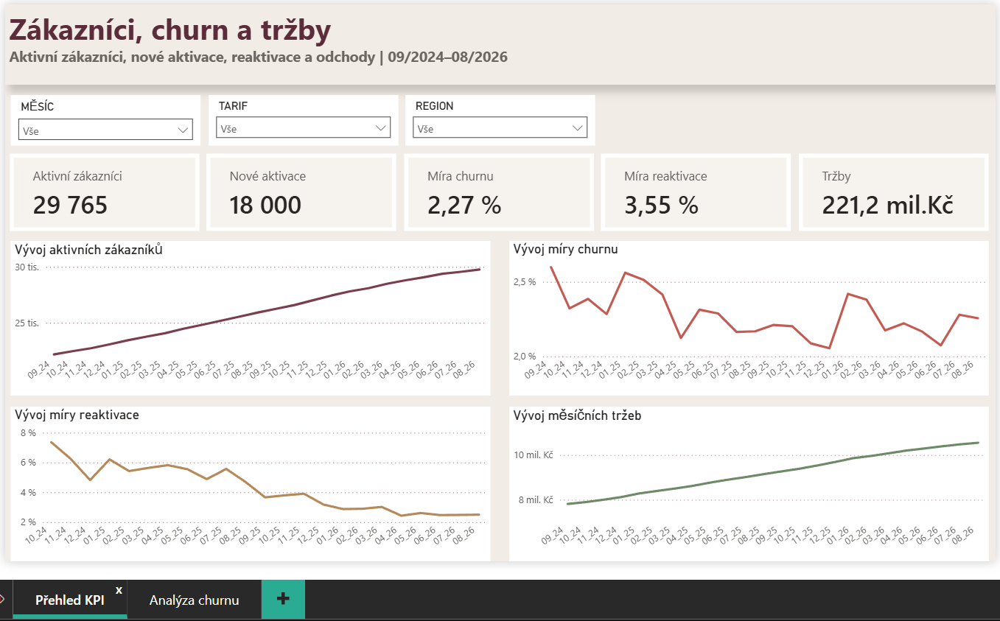
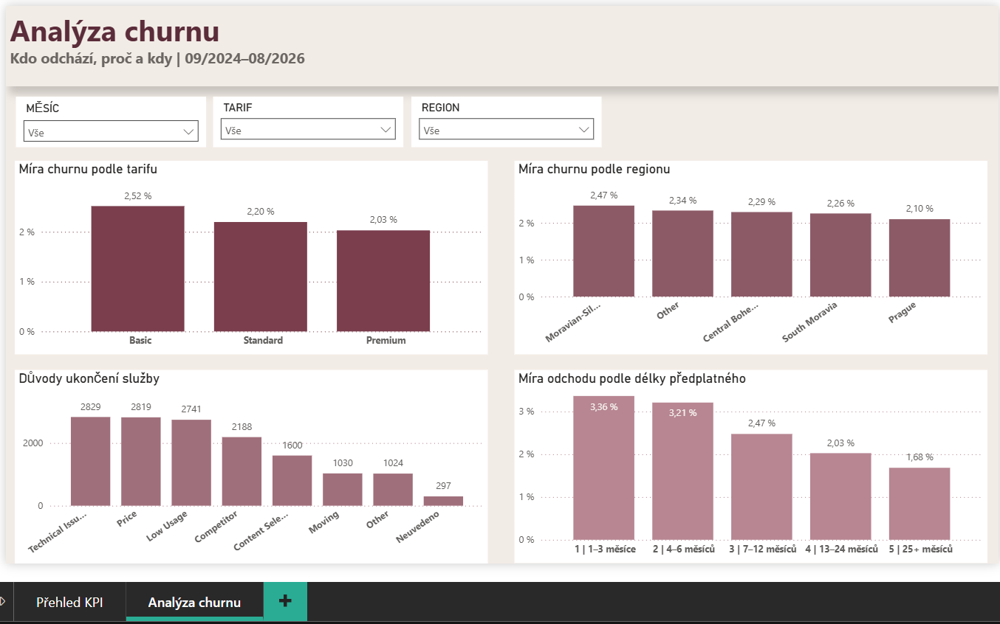
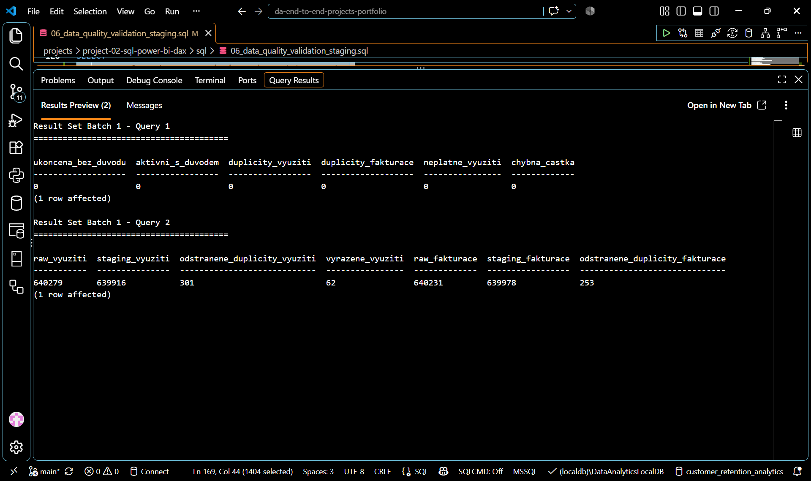
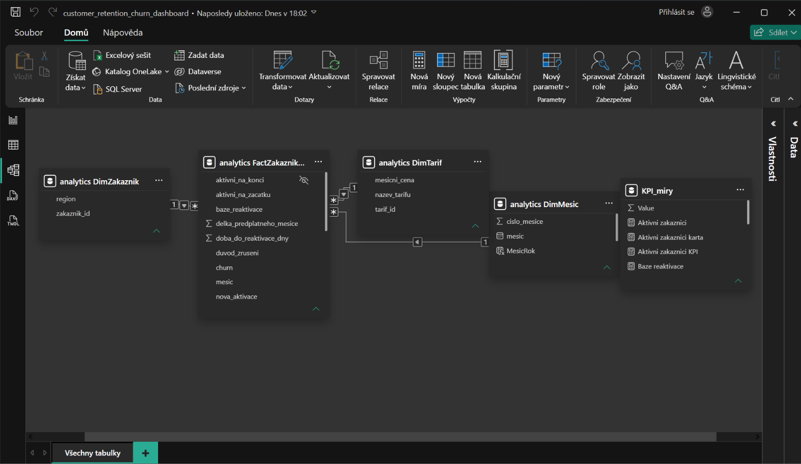
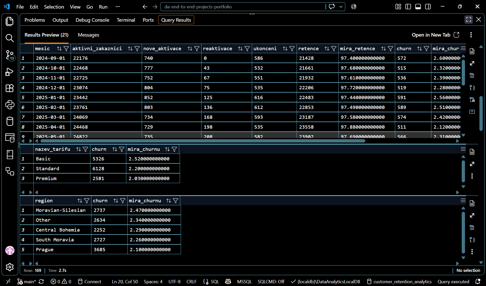

# Project 02 – Customer Retention & Churn Analysis
## SQL Server, Power BI & DAX

# Přehled projektu

Projekt analyzuje vývoj zákaznické základny, churn, reaktivace a tržby smyšlené společnosti poskytující měsíční předplatné internetové televize. Cílem je zjistit, které zákaznické skupiny odcházejí častěji, kdy je riziko odchodu nejvyšší, jaké důvody zákazníci uvádějí a jakou roli hrají návraty zákazníků.

Analýza vychází z **6 syntetických CSV zdrojů za období 09/2024–08/2026** a zahrnuje **40 000 zákazníků a 44 277 předplatných**.

- **Nástroje:** SQL Server LocalDB, Power BI Desktop, DAX a Git.
- **Zpracování dat:** načtení CSV do databáze, kontrola kvality, čištění, validace, vytvoření clean vrstvy a analytického modelu.
- **Analýza:** vývoj zákaznické základny, churn podle tarifu a regionu, důvody ukončení, délka předplatného, reaktivace a tržby.
- **Hlavní výstup:** dvoustránkový Power BI dashboard doplněný o analytická zjištění a doporučení.
- **Business přínos:** podpora rozhodování o retenčních prioritách, rizikových segmentech a vývoji zákaznické základny.





Analytická zjištění a business doporučení jsou uvedena níže v tomto README, nebo ve větším detailu zde: [Detailní zjištění a doporučení](output/findings_and_recommendations.md).

---

# Business problém

Společnost sleduje růst počtu zákazníků a tržeb, ale potřebuje lépe porozumět odchodům zákazníků a jejich návratům. Samotný počet ukončených předplatných nestačí, protože se v čase mění i velikost zákaznické základny.

Projekt podporuje rozhodování zejména o:
- vývoji zákaznické základny a churnu;
- segmentech s vyšší mírou odchodu;
- důvodech ukončení služby;
- období zákaznického vztahu s vyšším rizikem odchodu;
- reaktivacích bývalých zákazníků;
- vývoji tržeb.

Hlavní analytické otázky:
1. Jak se vyvíjí zákaznická základna, churn a retence?
2. Kteří zákazníci odcházejí a jaké důvody uvádějí?
3. Jak se odchod mění s délkou předplatného?
4. Jak často se zákazníci vracejí?
5. Jak se vyvíjejí tržby a jak souvisejí s jednotlivými segmenty?

---

# Cíloví uživatelé

Primárním uživatelem je **manažer odpovědný za retenci zákazníků a vývoj zákaznické základny**.

Sekundárními uživateli jsou:
- management;
- Retention / Customer Success;
- Product / Commercial;
- CRM;
- Pricing;
- zákaznická podpora;
- datový analytik.

---

# Zdroje dat

Projekt používá syntetická CSV data simulující výstupy provozních systémů. Hlavní transformační a business logiku zajišťuje SQL Server.

| Zdroj                 | Obsah                     | Granularita |
| `customers.csv`       | zákazníci a region        | 1 řádek = 1 zákazník |
| `subscriptions.csv`   | historie předplatných     | 1 řádek = 1 předplatné |
| `plans.csv`           | tarify a měsíční ceny     | 1 řádek = 1 tarif |
| `monthly_usage.csv`   | měsíční využívání služby  | 1 řádek = 1 předplatné × měsíc |
| `billing.csv`         | měsíční fakturace         | 1 řádek = 1 předplatné × měsíc |
| `support_cases.csv`   | případy zákaznické podpory| 1 řádek = 1 případ podpory |

Analyzované období je **09/2024–08/2026**.

Dataset je syntetický a neobsahuje skutečná osobní ani důvěrná data.

---

# Architektura

Hlavní tok zpracování:
```text
CSV
  ↓
SQL raw
  ↓
kontrola kvality
  ↓
staging
  ↓
čištění + validace
  ↓
clean
  ↓
analytics
  ↓
Power BI model
  ↓
DAX + dashboard
```

SQL Server zajišťuje hlavní transformační a business logiku. Power BI načítá pouze analytickou vrstvu a používá ji pro datový model, DAX measures a dashboard.

---

# Role nástrojů

| Nástroj               | Role v projektu |
| CSV                   | zdrojová data |
| SQL Server LocalDB    | načtení, validace, čištění, transformace a analytická vrstva |
| Power BI Desktop      | datový model, analýza a dashboard |
| DAX                   | KPI a dynamické výpočty podle filtru |
| Git / GitHub          | verzování a publikace portfolio projektu |

Projekt nepoužívá Python ani Power BI Service.

---

# Kvalita dat

Zdrojová data obsahovala několik typických problémů:
- **301** duplicit podle business key v měsíčním využití;
- **253** duplicit podle business key ve fakturaci;
- **62** neplatných řádků měsíčního využití;
- **58** chybných fakturovaných částek;
- **297** ukončených předplatných bez uvedeného důvodu zrušení.

Čištění probíhalo ve staging vrstvě, zatímco raw data zůstala beze změny. Po opravách proběhla validační kontrola a reconciliation.

```text
MesicniVyuziti
640 279 raw
- 301 duplicit
- 62 vyřazených řádků
= 639 916 clean

Fakturace
640 231 raw
- 253 duplicit
= 639 978 clean
```



Detailní popis: [`docs/data_quality_and_cleaning.md`](docs/data_quality_and_cleaning.md)

---

# Analytický model

Hlavní analytická tabulka:
```text
analytics.FactZakaznikMesic
```

Granularita:
```text
1 řádek = 1 zákazník × 1 relevantní měsíc
```

Model používá jednoduché hvězdicové schéma:
```text
DimZakaznik
     ↓
DimMesic → FactZakaznikMesic ← DimTarif
```

Použité tabulky:
- `analytics.FactZakaznikMesic`;
- `analytics.DimZakaznik`;
- `analytics.DimTarif`;
- `analytics.DimMesic`.

Fact tabulka obsahuje **756 235 řádků**. Vztahy v Power BI jsou typu **1 : \*** a vedou z dimenzí do fact tabulky.



Detailní popis modelu a DAX: [`docs/analytical_model_and_kpi.md`](docs/analytical_model_and_kpi.md)

---

# KPI

Hlavní KPI dashboardu:
| KPI               | Význam |
| Aktivní zákazníci | počet zákazníků aktivních na konci měsíce |
| Nové aktivace     | první aktivace zákazníků |
| Míra churnu       | podíl churnů na zákaznících aktivních na začátku měsíce |
| Míra reaktivace   | podíl reaktivací na zákaznících dostupných pro návrat |
| Tržby             | měsíční fakturované tržby |

Hlavní KPI byly ověřeny proti SQL výsledkům.

Příklad pro **08/2026**:
```text
Aktivní zákazníci → 29 765
Nové aktivace     → 653
Churn             → 667
Míra churnu       → 2,26 %
Reaktivace        → 245
Míra reaktivace   → 2,50 %
Tržby             → 10 549 662
```

---

# Analýza

EDA proběhla nejprve v SQL a následně byla interaktivně ověřena v Power BI.

Analýza se zaměřila zejména na:
- vývoj zákaznické základny a churnu v čase;
- churn podle tarifu, regionu a typu předplatného;
- důvody ukončení služby;
- míru odchodu podle délky předplatného;
- reaktivace a dobu do návratu;
- vývoj tržeb a jejich strukturu.



Detailní EDA: [`docs/eda_sql_power-bi.md`](docs/eda_sql_power-bi.md)

---

# Dashboard

Power BI dashboard obsahuje dvě stránky.

## Přehled KPI

Obsahuje:
- 5 hlavních KPI karet;
- vývoj aktivních zákazníků;
- vývoj churn rate;
- vývoj míry reaktivace;
- vývoj měsíčních tržeb.

## Analýza churnu

Obsahuje:
- churn podle tarifu;
- churn podle regionu;
- důvody ukončení;
- míru odchodu podle délky předplatného.

Na obou stránkách jsou použity filtry:
```text
Měsíc
Tarif
Region
```

Dashboard používá Power BI Desktop v režimu Import a aktualizuje se ručně pomocí **Refresh**.

---

# Zjištění

Hlavní datově podložená zjištění:
1. **Zákaznická základna roste, ale tempo růstu zpomaluje.**  
   Aktivní zákazníci vzrostli z **22 176** na **29 765**, tedy o **34,2 %**, ale čistý měsíční přírůstek byl v roce 2026 nižší než ve srovnatelném období 2025.

2. **Churn rate zůstává relativně stabilní.**  
   Během období se pohyboval přibližně mezi **2,0–2,6 %**.

3. **Basic má nejvyšší churn rate.**  
   Basic dosahuje **2,52 %**, Standard **2,20 %** a Premium **2,03 %**.

4. **První půlrok předplatného je nejrizikovější.**  
   Míra odchodu je nejvyšší v prvních šesti měsících a s délkou vztahu postupně klesá.

5. **Důvody odchodu nejsou soustředěny do jediné kategorie.**  
   Nejčastější jsou `Technical Issues`, `Price` a `Low Usage`.

6. **Reaktivovaná předplatná mají vyšší churn než první předplatná.**  
   Churn rate je **3,14 %** u reaktivovaných a **2,22 %** u prvních předplatných.

7. **Počet reaktivací roste, ale jejich míra klesá.**  
   Průměrná doba do návratu je přibližně **120 dní**.

8. **Tržby během sledovaného období rostou.**  
   Měsíční tržby vzrostly přibližně z **7,81 mil. Kč** na **10,55 mil. Kč**.

---

# Doporučení

| Oblast            | Doporučení | Vlastník |
| Prvních 6 měsíců  | Otestovat retenční pilot pro zákazníky v prvních 1–6 měsících. | Retention / Customer Success |
| Basic             | Samostatně analyzovat a testovat retenční opatření pro tarif Basic. | Product / Commercial |
| Technical Issues  | Prověřit nejčastější technické problémy spojené s ukončením. | Customer Support / Technical Operations |
| Price             | Ověřit cenovou citlivost jednotlivých tarifních segmentů. | Pricing / Product |
| Low Usage         | Prověřit, zda nízké využívání může sloužit jako časný varovný signál. | Product / CRM |
| Reaktivace        | Testovat reaktivační komunikaci přibližně 3.–4. měsíc po ukončení. | CRM / Retention |
| Monitoring        | Sledovat společně aktivní zákazníky, nové aktivace, ukončení, churn a reaktivace. | Management / Analytics |

Doporučení představují návrhy k dalšímu ověření, nikoliv důkaz příčiny nebo garantovaný výsledek.

Detailní zjištění a doporučení: [`output/findings_and_recommendations.md`](output/findings_and_recommendations.md)

---

# Automatizace

Projekt nepoužívá externí plánovač ani Power BI Service.

Zpracování je opakovatelné pomocí připravených SQL skriptů:
```text
CSV
  ↓
SQL skripty 01–09
  ↓
raw → staging → clean → analytics
  ↓
Power BI Desktop
  ↓
Refresh
```

Validace je součástí SQL workflow a Power BI report se obnovuje ručně.

---

# Omezení

Hlavní omezení analýzy:
- dataset je syntetický;
- historie pokrývá 24 měsíců;
- analýza je primárně popisná;
- chybí detailní informace o cenových změnách, marketingových kampaních a technických incidentech;
- evidovaný důvod ukončení nemusí být skutečnou hlavní příčinou;
- výsledky neprokazují kauzalitu;
- projekt neobsahuje prediktivní churn model ani experimentální ověření doporučení.

Výsledky proto slouží jako podklad pro rozhodování a další prověření, nikoliv jako automatický důkaz příčiny nebo garance výsledku.

---

# Jak projekt spustit

Projekt vyžaduje SQL Server LocalDB a Power BI Desktop.

1. Zachovat projektovou strukturu složek.
2. V SQL Serveru spustit skripty ze složky `sql/` v pořadí `01` až `09`.
3. Ověřit úspěšnou validaci clean a analytics vrstvy.
4. Otevřít `power-bi/customer_retention_churn_dashboard.pbix`.
5. Obnovit data pomocí **Refresh**.
6. Zkontrolovat KPI a obě stránky dashboardu.

SQL instance použitá při vývoji:
```text
(localdb)\DataAnalyticsLocalDB
```

Databáze:
```text
customer_retention_analytics
```

---

# Struktura repozitáře

```text
project-02-sql-power-bi-dax/
├── data/
│   └── source/
│       ├── billing.csv
│       ├── customers.csv
│       ├── monthly_usage.csv
│       ├── plans.csv
│       ├── subscriptions.csv
│       └── support_cases.csv
│
├── docs/
│   ├── analytical_model_and_kpi.md
│   ├── data_quality_and_cleaning.md
│   └── eda_sql_power-bi.md
│
├── output/
│   ├── screenshots/
│   │   ├── 01_dashboard_overview.png
│   │   ├── 02_dashboard_churn_analysis.png
│   │   ├── 03_power_bi_data_model.png
│   │   ├── 04_sql_data_quality_validation.png
│   │   ├── 05_sql_analytical_validation.png
│   │   └── 06_sql_eda.png
│   └── findings_and_recommendations.md
│
├── power-bi/
│   ├── customer_retention_churn_dashboard.pbix
│   └── power_bi_theme_warm_burgundy_business.json
│
├── sql/
│   ├── 01_create_database_schemas.sql
│   ├── 02_create_raw_layer.sql
│   ├── 03_data_quality_validation_raw.sql
│   ├── 04_create_staging_layer.sql
│   ├── 05_data_cleaning_staging.sql
│   ├── 06_data_quality_validation_staging.sql
│   ├── 07_create_clean_layer.sql
│   ├── 08_create_analytical_layer.sql
│   └── 09_sql_eda.sql
│
├── .gitignore
└── README.md
```

- `data/source/` – původní syntetická CSV data;
- `sql/` – databázové vrstvy, validace, čištění, analytický model a SQL EDA;
- `docs/` – detailnější technická a analytická dokumentace;
- `power-bi/` – Power BI report a použitý motiv;
- `output/` – finální business výstupy a screenshoty;
- `README.md` – stručný přehled projektu pro rychlou orientaci.

Projekt je verzován pomocí Git a publikován v GitHub repozitáři.