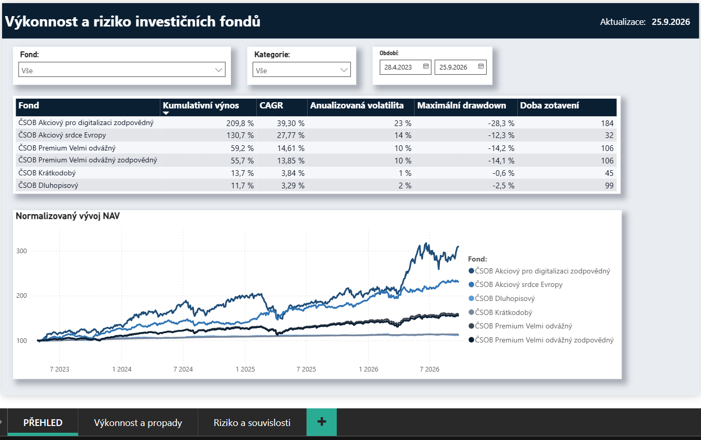
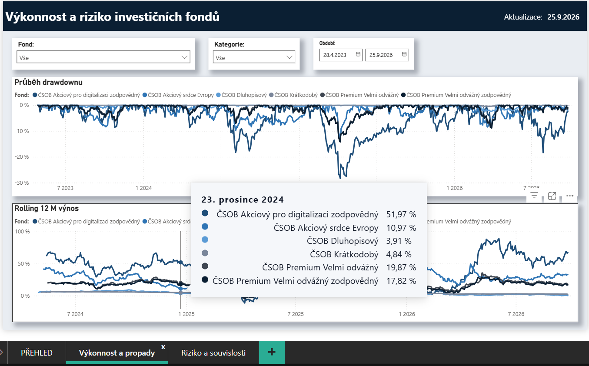
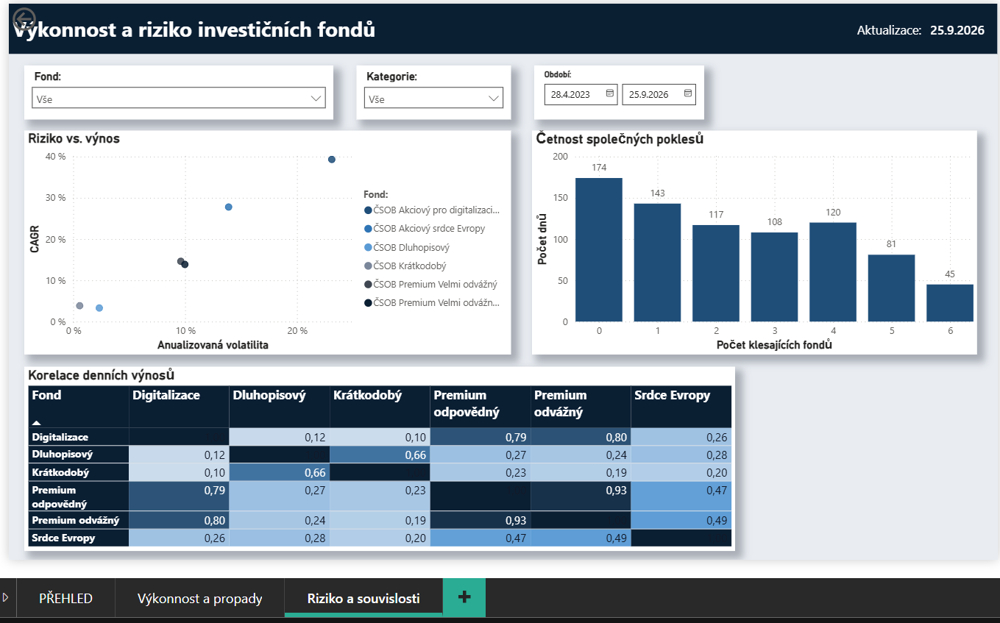
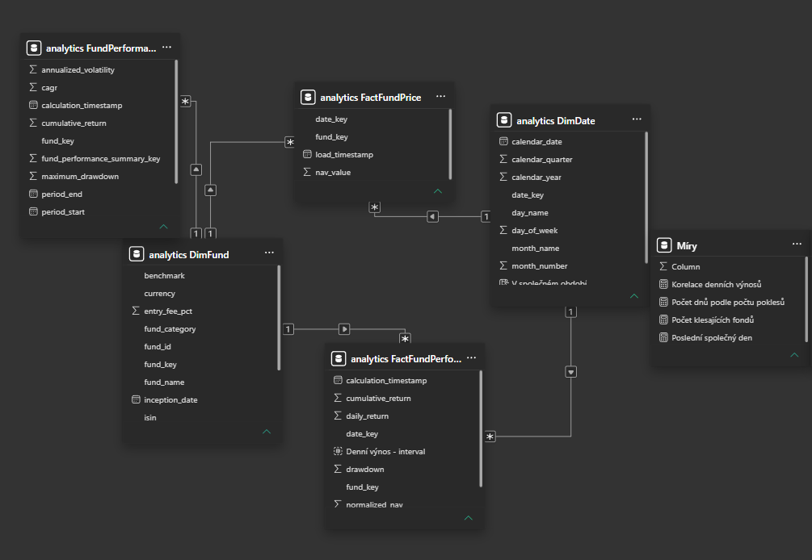
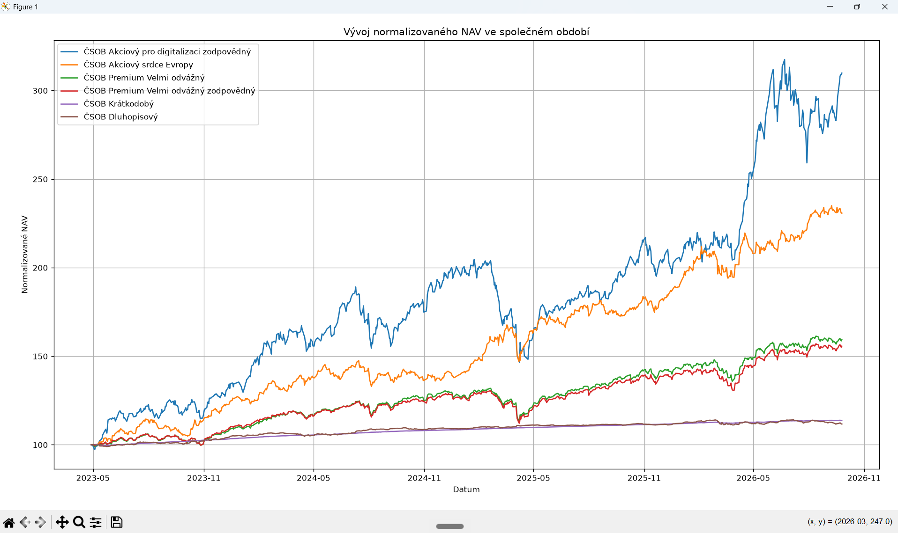
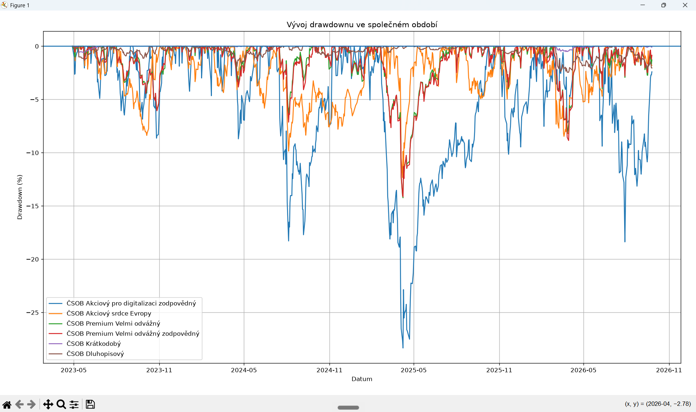
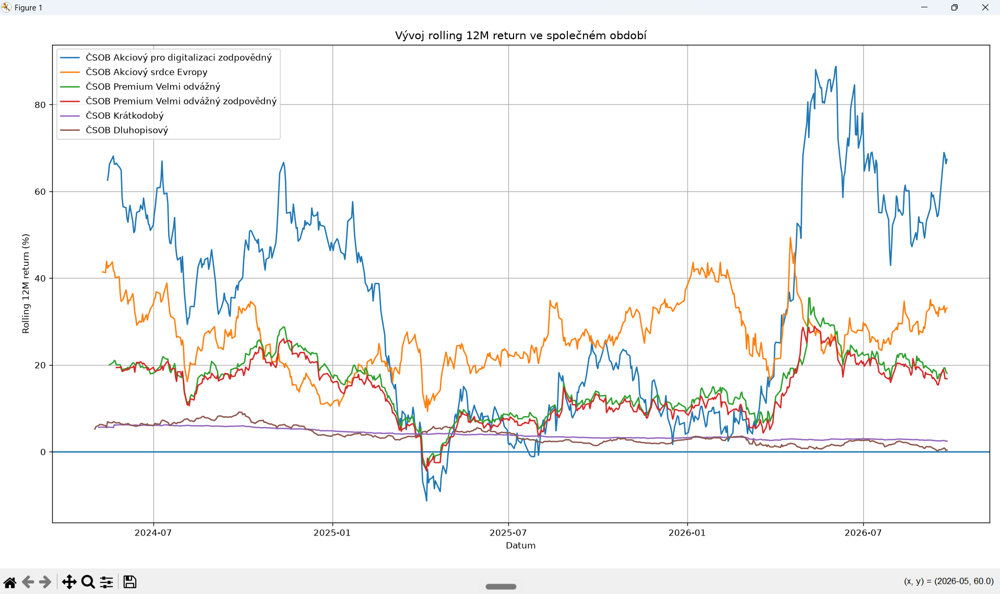
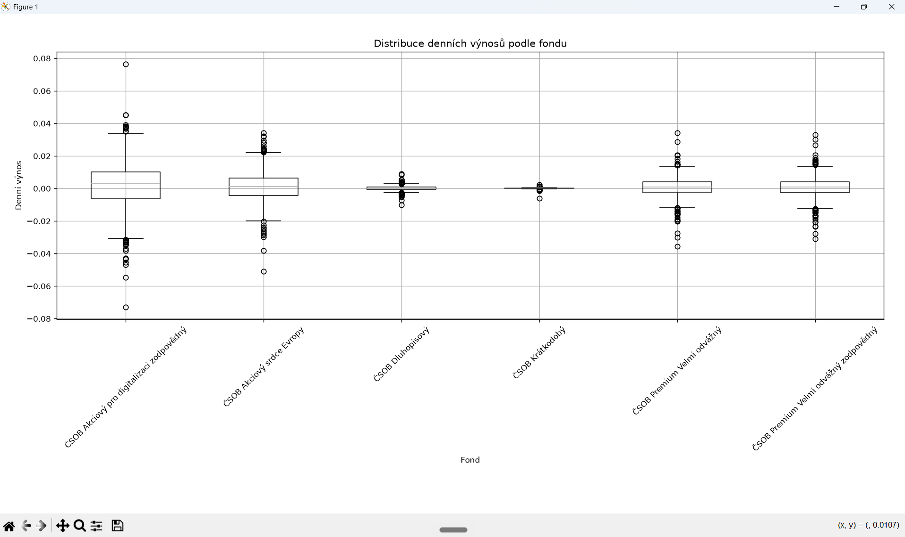
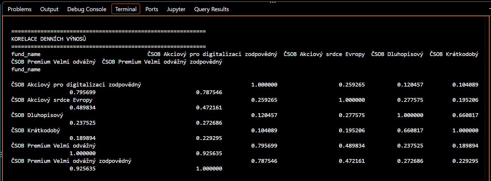
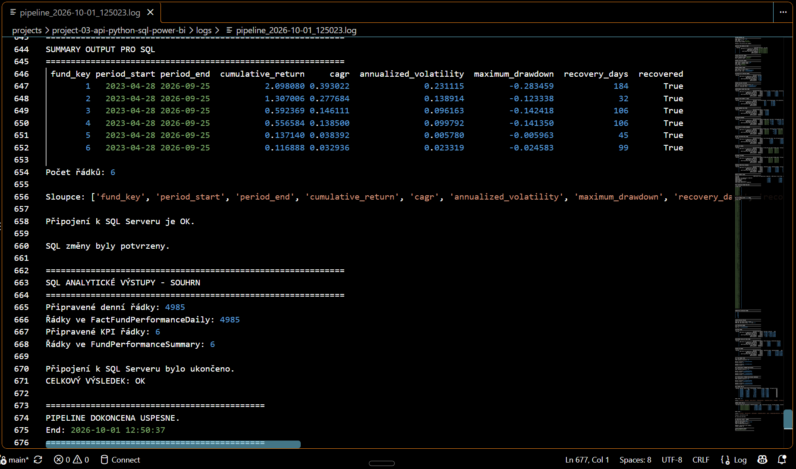

# Project 03 – Analýza výkonnosti a rizika investičních fondů
## API + Python + SQL Server + Power BI

# Přehled projektu

Projekt analyzuje historickou výkonnost a rizikové charakteristiky **6 vybraných investičních fondů ČSOB** ve třech kategoriích: akciové, smíšené a dluhopisové.

Analýza porovnává zejména:
- dlouhodobý výnos;
- volatilitu;
- velikost historických propadů;
- dobu zotavení;
- stabilitu výkonnosti v čase;
- korelace denních výnosů;
- společné poklesy fondů.

- **Nástroje:** Python, Pandas, SciPy, SQL Server LocalDB, SQL, Power BI, Power Query, DAX, Git a GitHub.
- **Zdroj dat:** ČSOB JSON prices endpoint + veřejně dostupné produktové informace.
- **Zpracování dat:** acquisition → raw snapshot → validace → incremental SQL load → analytické výpočty → Power BI.
- **Hlavní výstup:** třístránkový Power BI dashboard doplněný o EDA, SDA, automatizovanou pipeline a dokumentaci.
- **Business přínos:** transparentnější porovnání historického výnosu a rizika bez redukce rozhodování na jedinou metriku.







Detailnější souhrn zjištění a doporučení je dostupný zde:  
[Detailní zjištění a doporučení](output/findings_and_recommendations.md)

---

# Business problém

Samotná historická výkonnost neposkytuje úplný pohled na chování investičního fondu.

Fondy s vysokým nebo podobným dlouhodobým výnosem mohou dosahovat výsledků při výrazně odlišném:
- kolísání;
- maximum drawdownu;
- průběhu propadů;
- recovery time;
- vývoji rolling 12M výnosů.

Projekt proto hodnotí **výnos a riziko společně** a sleduje také jejich vývoj v čase.

Fondy byly při sestavení vzorku vybrány jako dva fondy s nejvyšší dostupnou tříletou historickou výkonností v každé sledované kategorii. Cílem proto není hodnotit celý trh, ale ukázat, že samotný historický výnos neposkytuje úplný obraz o chování fondu.

Hlavní business otázka:
> Dosahují fondy historicky atraktivních výsledků podobným způsobem, nebo se výrazně liší z hlediska rizika, stability a chování během poklesů?

Hlavní analytické otázky:
1. Jak se vyvíjela hodnota a výnos jednotlivých fondů ve společném období?
2. Jak se fondy liší z hlediska rizika a velikosti propadů?
3. Jak stabilní byla jejich výkonnost v čase?
4. Jaké rozdíly lze pozorovat mezi vybranými akciovými, smíšenými a dluhopisovými fondy?
5. Do jaké míry se fondy pohybují společně a jak se chovají během poklesů?

Analýza nepředstavuje investiční doporučení a neurčuje, který fond koupit nebo prodat.

---

# Cíloví uživatelé

Primárním uživatelem je **produktový nebo investiční tým** sledující historickou výkonnost a rizikové charakteristiky fondů.

Sekundárními uživateli mohou být:
- management;
- reportingový tým;
- datový analytik.

---

# Zdroje dat

Projekt používá dva hlavní typy zdrojů.

| Zdroj                         | Obsah                         | Použití                   | Granularita                               |
| ČSOB JSON prices endpoint     | historické NAV / ceny fondů   | hlavní časová řada        | 1 řádek = 1 fond, 1 dostupné datum, 1 NAV |    
| KID a produktové informace    | metadata fondů                | popisná dimenze `DimFund` |

Endpoint:
```text
https://www.csob.cz/spa/fund/funds-detail/funds/{fund_id}/prices
```

Business key:
```text
fund_id + date
```

Raw JSON snapshoty jsou ukládány do:
```text
data/raw/funds_prices/
```

Do GitHub repozitáře je místo celé raw historie zařazen pouze ukázkový soubor:
```text
data/sample/sample_fund_prices.json
```

Detail zdrojů: [`docs/data_sources.md`](docs/data_sources.md)

---

# Architektura

Hlavní tok projektu:
```text
ČSOB JSON endpoint
        ↓
Python acquisition
        ↓
Raw JSON snapshots
        ↓
Python validace
        ↓
SQL Server – historická vrstva
        ↓
Python analytické výpočty
        ↓
SQL Server – analytická vrstva
        ↓
Power BI
        ↓
dashboard + interpretace
```

Oddělení rolí:

```text
Python
→ získání dat
→ validace
→ incremental load
→ analytické výpočty
→ EDA / SDA / KPI
→ automatizace

SQL Server
→ historické uložení
→ integrita dat
→ analytické tabulky
→ zdroj pro Power BI

Power BI
→ datový model
→ DAX
→ interaktivní analýza
→ prezentace výsledků
```

---

# Kvalita a validace dat

Validace se zaměřuje na reálná rizika práce s API a časovou řadou.

Kontroluje se zejména:
- dostupnost a struktura JSON odpovědi;
- chybějící hodnoty;
- přesné duplicity;
- duplicitní timestampy;
- neplatné nebo nulové NAV;
- chronologické pořadí;
- převod timestampu na datum;
- referenční integrita vůči `DimFund` a `DimDate`;
- duplicity kombinace `fund_key + date_key`;
- poslední dostupné NAV podle fondu.

Základní validační tok:
```text
Raw JSON
→ technická transformace
→ safe cleaning
→ validace
→ SUCCESS / FAILED
→ SQL load pouze při úspěchu
```

Pipeline používá exit code:
```text
0
→ pokračovat

1
→ zastavit pipeline
```

SQL vrstva má navíc samostatný validační skript, který může být případně spuštěn manuálně:
```text
sql/03_data_validation.sql
```

---

# SQL datový model

Databáze:
```text
fund_performance_analytics
```

Schéma:
```text
analytics
```

Hlavní tabulky:
```text
analytics.DimFund
analytics.DimDate
analytics.FactFundPrice
analytics.FactFundPerformanceDaily
analytics.FundPerformanceSummary
```

Vztahy:
```text
DimFund 1:* FactFundPrice
DimDate 1:* FactFundPrice

DimFund 1:* FactFundPerformanceDaily
DimDate 1:* FactFundPerformanceDaily

DimFund 1:* FundPerformanceSummary
```

Směr filtrování:
```text
dimension
→ fact
```

`FundPerformanceSummary` není propojena s `DimDate`, protože obsahuje souhrnná KPI za celé analytické období.



---

# Incremental load

Endpoint při každém běhu vrací dostupnou historii fondu. SQL load proto nepoužívá full reload.

Logika:
```text
nejnovější raw snapshot
→ připravit date_key
→ načíst existující date_key z SQL
→ porovnat
→ vložit pouze nové řádky
```

Business unikátnost v SQL:
```text
UNIQUE (fund_key, date_key)
```

Opakovaný běh bez nových zdrojových NAV hodnot proto vloží:
```text
0 nových řádků
```

Pipeline je tímto způsobem idempotentní vůči již uloženým business záznamům.

---

# KPI

- Kumulativní výnos – celková procentní změna hodnoty fondu od začátku do konce společného sledovaného období. Ukazuje, o kolik se hodnota fondu za celé období zvýšila nebo snížila, bez převodu na roční tempo.

- CAGR (Compound Annual Growth Rate) – složené průměrné roční tempo růstu, které by při konstantním ročním zhodnocení vedlo ze skutečné počáteční hodnoty ke skutečné konečné hodnotě fondu za celé sledované období. Nevyjadřuje skutečný výnos v jednotlivých letech, ale vyhlazené roční tempo odpovídající celkovému zhodnocení.

- Anualizovaná volatilita – míra historického kolísání denních výnosů převedená na roční úroveň. Vychází ze směrodatné odchylky denních výnosů a v této analýze je anualizována pomocí odmocniny z 252 dostupných ocenění za rok. Vyšší hodnota znamená větší proměnlivost výnosů, nikoli automaticky vyšší ztrátu.

- Maximum drawdown – největší historický pokles hodnoty fondu od do té doby dosaženého maxima k následnému minimu. Vyjadřuje nejhlubší relativní propad, který fond během sledovaného období zaznamenal.

- Doba zotavení (Recovery time) – počet kalendářních dní od dna největšího propadu do prvního okamžiku, kdy se hodnota NAV vrátila alespoň na úroveň předchozího maxima. Doplňuje maximum drawdown o informaci, jak dlouho trval návrat po nejhlubším propadu.

Doplňkové analytické metriky:

- Rolling 12M return – výnos za průběžně se posouvající přibližně 12měsíční období. V analýze je počítán jako změna NAV vůči hodnotě před 252 dostupnými oceněními. Jde o aproximaci 12 měsíců podle počtu oceněných dnů, nikoli o přesných 365 kalendářních dní. Slouží především k posouzení stability a proměnlivosti výkonnosti v čase.

- Nejlepší a nejslabší rolling 12M období – období, ve kterých fond dosáhl nejvyššího a nejnižšího rolling 12M výnosu. Umožňují určit, jak výrazně se 12měsíční výkonnost fondu během sledované historie měnila.

- Průběh drawdownu – časový vývoj relativní vzdálenosti aktuální hodnoty NAV od dosavadního maxima. Umožňuje sledovat nejen nejhlubší propad, ale také četnost, délku a průběh jednotlivých poklesových období.

- Korelace denních výnosů – míra podobnosti historického pohybu denních výnosů mezi dvojicemi fondů. Hodnota blízká +1 znamená velmi podobný pohyb stejným směrem, hodnota kolem 0 slabou lineární souvislost a hodnota blízká -1 pohyb opačným směrem. Korelace nevyjadřuje příčinný vztah.

- Společné poklesy – počet fondů, které ve stejný den zaznamenaly záporný denní výnos. Analýza je prováděna pouze pro dny, kdy je denní výnos dostupný u všech šesti sledovaných fondů, a slouží k identifikaci období, kdy klesala většina fondů současně.

Souhrn aktuálního analytického výstupu:
| Fond                                      | Kumulativní výnos | CAGR      | Volatilita    | Max. drawdown | Zotavení |
| ČSOB Akciový pro digitalizaci zodpovědný  | 209,8 %           | 39,3 %    | 23,1 %        | -28,3 %       | 184 dní |
| ČSOB Akciový srdce Evropy                 | 130,7 %           | 27,8 %    | 13,9 %        | -12,3 %       | 32 dní |
| ČSOB Premium Velmi odvážný                | 59,2 %            | 14,6 %    | 9,6 %         | -14,2 %       | 106 dní |
| ČSOB Premium Velmi odvážný zodpovědný     | 55,7 %            | 13,9 %    | 10,0 %        | -14,1 %       | 106 dní |
| ČSOB Krátkodobý                           | 13,7 %            | 3,8 %     | 0,6 %         | -0,6 %        | 45 dní |
| ČSOB Dluhopisový                          | 11,7 %            | 3,3 %     | 2,3 %         | -2,5 %        | 99 dní |

---

# Analýza

EDA a SDA jsou provedeny v:
```text
notebooks/01_fund_performance_eda_sda.ipynb
```

Hlavní analytické oblasti:
- normalizovaný vývoj NAV;
- denní výnosy;
- kumulativní výnos;
- volatilita;
- maximum drawdown;
- recovery time;
- rolling 12M return;
- nejlepší a nejslabší období;
- korelace;
- společné poklesy;
- statistické ověření nejsilnějších korelačních vztahů.

Ukázky analytických výstupů:










---

# Power BI dashboard

Power BI používá Import režim a jako zdroj načítá SQL Server analytickou vrstvu. Report obsahuje tři stránky.

## 1. PŘEHLED

Obsahuje:
- slicer `Fond`;
- slicer `Kategorie`;
- slicer `Období`;
- KPI matici;
- Normalizovaný vývoj NAV.

KPI matice používá souhrnná KPI za celé společné analytické období. Datumový slicer proto ovlivňuje graf vývoje NAV, ale ne KPI matici.

## 2. Výkonnost a propady

Obsahuje:
- Průběh drawdownu;
- Rolling 12M výnos.

Všechny tři slicery ovlivňují oba grafy.

## 3. Riziko a souvislosti

Obsahuje:
- Riziko vs. výnos;
- Četnost společných poklesů;
- Korelaci denních výnosů.

Interakce slicerů jsou nastaveny podle metodiky jednotlivých vizuálů:
```text
Fond / Kategorie
→ filtrují Riziko vs. výnos
→ neovlivňují společné poklesy a korelační matici

Období
→ neovlivňuje Riziko vs. výnos
→ filtruje společné poklesy a korelační matici
```

Slicery jsou synchronizovány mezi všemi stránkami.

Report používá vlastní modro-šedý motiv.

Power BI report:
```text
power-bi/fund_performance_risk_dashboard.pbix
```

---

# Zjištění

Hlavní datově podložená zjištění:

1. **Nejvyšší historický výnos byl současně spojen s nejvyšším rizikem.**  
   Fond Digitalizace měl nejvyšší kumulativní výnos, ale zároveň nejvyšší volatilitu, nejhlubší drawdown a nejdelší dobu zotavení.

2. **Srdce Evropy vykázalo vysoký historický výnos při výrazně nižším rizikovém profilu než Digitalizace.**  
   Mělo nižší volatilitu, mělčí drawdown a podstatně kratší recovery time.

3. **Oba Premium fondy se chovaly velmi podobně.**  
   Měly podobný výnos, volatilitu, drawdown i shodnou dobu zotavení. Jejich denní výnosy navíc vykazovaly velmi silnou korelaci.

4. **Vybrané dluhopisové fondy měly nejnižší výnosy, ale také nejnižší kolísání a nejmírnější propady.**

5. **Rolling 12M výnosy ukázaly výrazný rozdíl ve stabilitě.**  
   Digitalizace měla nejproměnlivější roční výkonnost, zatímco dluhopisové fondy byly výrazně stabilnější.

6. **Duben 2025 představoval společné slabší období.**  
   V několika analýzách se současně objevila dna drawdownů, slabé rolling 12M výsledky a společné denní poklesy.

7. **Stejná kategorie automaticky neznamenala podobný historický pohyb.**  
   Dva vybrané akciové fondy měly mezi sebou výrazně nižší korelaci než některé dvojice z různých kategorií.

Detail: [`output/findings_and_recommendations.md`](output/findings_and_recommendations.md)

---

# Doporučení

Doporučení projektu se netýkají nákupu nebo prodeje konkrétních fondů. Týkají se způsobu analytického hodnocení a reportingu.

| Oblast            | Doporučení
| Výnos vs. riziko  | Hodnotit výnos vždy společně s volatilitou, drawdownem a recovery time.
| Stabilita         | Vedle konečných KPI sledovat rolling 12M a průběh drawdownu v čase.
| Propady           | Odděleně sledovat hloubku propadu a dobu zotavení.
| Korelace          | Posuzovat skutečné historické korelace, ne pouze kategorii fondu.
| Stresová období   | Použít duben 2025 jako referenční období pro případnou detailnější analýzu.
| Interpretace      | Závěry formulovat pouze pro 6 vybraných fondů a nezobecňovat je na celý trh.

Doporučení představují návrh analytického a reportingového přístupu, nikoliv investiční doporučení nebo garanci budoucího výsledku.

---

# Automatizace

Projekt používá automatizovaný Python proces spouštěný přes:
```text
run_pipeline.bat
+
Windows Task Scheduler
```

Denní plán:
```text
08:00
```

Automatizovaný tok:
```text
02_acquire_fund_prices.py
        ↓
03_validate_clean_fund_prices.py
        ↓
05_load_fund_prices_to_sql.py
        ↓
06_analyze_fund_performance.py
```

Skript:
```text
01_check_fund_endpoints.py
```
slouží jako manuální kontrola dostupnosti endpointů.

Skript:
```text
04_initialize_dimensions.py
```
je inicializační / jednorázový krok.

Task Scheduler je nastaven tak, aby:
- spustil úlohu co nejdříve po zmeškaném startu;
- mohl počítač probudit;
- při chybě provedl opakovaný pokus;
- nespouštěl novou instanci, pokud již předchozí běží.

Pipeline zapisuje průběh do:
```text
logs/
```



Důležité:
```text
Python + SQL
→ aktualizují se automaticky

Power BI Desktop
→ vyžaduje Refresh datového modelu, neboť autor nemá možnost použít Power BI Service
```

---

# Omezení

Hlavní omezení analýzy:
- vzorek obsahuje pouze 6 fondů;
- fondy byly vybrány záměrně podle vysoké historické tříleté výkonnosti;
- výběr není reprezentativní pro celý trh ani celé investiční kategorie;
- hlavní srovnání používá pouze společné analytické období;
- rolling 12M používá 252 dostupných ocenění jako aproximaci 12 měsíců;
- historická volatilita a drawdown nepopisují všechna investiční rizika;
- korelace neznamená příčinnou souvislost;
- statistická významnost nejsilnějších korelací není důkazem obecné platnosti vztahu;
- historická výkonnost nepředstavuje predikci budoucích výsledků;
- projekt neposkytuje investiční doporučení.

---

# Jak projekt spustit

Projekt vyžaduje:
```text
Python
SQL Server LocalDB
Power BI Desktop
```

SQL instance použitá při vývoji:
```text
(localdb)\DataAnalyticsLocalDB
```

Databáze:
```text
fund_performance_analytics
```

## 1. Python prostředí

Vytvořit a aktivovat virtuální prostředí a nainstalovat závislosti:
```bash
pip install -r requirements.txt
```

## 2. SQL databáze

Spustit SQL skripty:
```text
sql/01_create_database_star_schema.sql
sql/02_create_analytical_outputs.sql
```

Inicializovat dimenze:
```bash
python python/04_initialize_dimensions.py
```

## 3. Ověření endpointů

Volitelná manuální kontrola:
```bash
python python/01_check_fund_endpoints.py
```

## 4. Spuštění pipeline

Celý běžný proces lze spustit:
```text
run_pipeline.bat
```

nebo jednotlivě:
```bash
python python/02_acquire_fund_prices.py
python python/03_validate_clean_fund_prices.py
python python/05_load_fund_prices_to_sql.py
python python/06_analyze_fund_performance.py
```

## 5. SQL validace

Po loadu lze manuálně spustit:
```text
sql/03_data_validation.sql
```

## 6. Power BI

Otevřít:
```text
power-bi/fund_performance_risk_dashboard.pbix
```

a provést:
```text
Refresh
```

---

# Struktura repozitáře

```text
project-03-api-python-sql-power-bi/
│
├── data/
│   ├── raw/
│   │   └── funds_prices/
│   └── sample/
│       └── sample_fund_prices.json
│
├── docs/
│   └── data_sources.md
│
├── logs/
│   └── pipeline_*.log
│
├── notebooks/
│   └── 01_fund_performance_eda_sda.ipynb
│
├── output/
│   ├── screenshots/
│   │   ├── 01_overview.png
│   │   ├── 02_performance_drawdowns.png
│   │   ├── 03_risk_relationships.png
│   │   ├── 04_normalized_nav.png
│   │   ├── 05_drawdown_analysis.png
│   │   ├── 06_rolling_12m.png
│   │   ├── 07_daily_returns_distribution.png
│   │   ├── 08_correlation_heatmap.png
│   │   ├── 09_data_model.png
│   │   └── 10_pipeline_run.png
│   └── findings_and_recommendations.md
│
├── power-bi/
│   ├── fund_performance_risk_dashboard.pbix
│   └── power-bi_theme.json
│
├── python/
│   ├── 01_check_fund_endpoints.py
│   ├── 02_acquire_fund_prices.py
│   ├── 03_validate_clean_fund_prices.py
│   ├── 04_initialize_dimensions.py
│   ├── 05_load_fund_prices_to_sql.py
│   └── 06_analyze_fund_performance.py
│
├── sql/
│   ├── 01_create_database_star_schema.sql
│   ├── 02_create_analytical_outputs.sql
│   └── 03_data_validation.sql
│
├── .gitignore
├── README.md
├── requirements.txt
└── run_pipeline.bat
```

- `data/raw/` – automaticky ukládané raw JSON snapshoty; nejsou určeny k publikaci do Gitu;
- `data/sample/` – malý ukázkový zdrojový soubor;
- `docs/` – doplňková dokumentace zdrojů;
- `logs/` – logy automatizované pipeline;
- `notebooks/` – EDA a SDA;
- `output/` – screenshoty a finální analytické výstupy;
- `power-bi/` – Power BI report a vlastní motiv;
- `python/` – acquisition, validace, inicializace, SQL load a analytické výpočty;
- `sql/` – databázové objekty, analytické výstupy a validace;
- `README.md` – hlavní orientační dokument projektu.

---

# Co projekt ukazuje v portfoliu

Projekt rozšiřuje předchozí portfolio o programatické získávání dat, automatizaci a analýzu časových řad.
```text
Projekt 1
→ Excel + Power Query
→ logistická výkonnost

Projekt 2
→ SQL Server + Power BI
→ zákaznická retence

Projekt 3
→ API + Python + SQL Server + Power BI
→ investiční fondy
→ automatizované získávání dat
→ historické SQL uložení
→ analýza časových řad
→ Power BI reporting
```

Hlavní technické dovednosti demonstrované v projektu:
```text
API integration
Python data pipeline
data validation
incremental load
SQL star schema
time-series analytics
EDA / SDA
DAX
Power BI
Task Scheduler automation
Git / GitHub
```